iOS Design Agent Skill
======================

[](https://github.com/vermont42/iOS-Design-Agent-Skill/blob/main/LICENSE)
[](https://github.com/vermont42/iOS-Design-Agent-Skill/stargazers)

Expert iOS/SwiftUI design critique for any AI coding tool that supports the [Agent Skills open format](https://agentskills.io/home). This skill applies rigorous aesthetic standards to iOS/SwiftUI apps, adapted from Anthropic's Frontend Design Skill for web applications.


*Your app could look this good. The nene (Hawaiian goose) didn't settle for default plumage — neither should your UI.*

# What This Skill Does

The iOS Design Agent Skill teaches AI coding agents to evaluate SwiftUI interfaces the way a senior design consultant would: not just for correctness or accessibility compliance, but for **typographic sophistication, color cohesion, spatial composition, purposeful motion, and atmospheric depth**. It produces prioritized, actionable audits with exact SwiftUI code for every suggestion.

It also enforces an **anti-slop mandate**, rejecting the iOS equivalent of generic template aesthetics: unstyled `List` views, uniform `.body` fonts, flat backgrounds with no depth cues, and screens that look indistinguishable from Apple's Settings app. On the web, slop means "every site looks like a Tailwind template". On iOS, it means "every app looks like Apple's Settings app". The skill pushes past these defaults.

Most iOS design guidance focuses on usability, HIG compliance, accessibility, and consistency. This skill asks a different question: **"What's the one thing someone will remember?"** The goal isn't decoration but is rather amplification of whatever is already distinctive about your app so the UI reinforces it at every turn.

# History: The Frontend Design Skill

Anthropic created the **Frontend Design Skill** as a methodology for Claude to critique and improve web interfaces. [This skill](https://skills.sh/anthropics/skills/frontend-design) organizes design evaluation around five pillars: typography, color and theme, spatial composition, motion, and atmospheric depth. Great websites have a point of view. They don't just display content; they create experiences with personality, rhythm, and emotional resonance.

The skill is deliberately opinionated. It rejects "safe" design choices (system fonts with no pairing, white backgrounds with no surface variation, layouts that could belong to any site) in favor of bold, distinctive aesthetics that serve each project's specific identity. It also includes an "anti-slop" principle: a refusal to produce the generic, AI-generated aesthetics that plague modern web design.

Josh Adams applied the Frontend Design Skill to two web projects, demonstrating its range:

## racecondition.software
A technical [blog](https://racecondition.software) where the skill guided distinctive interactive elements:
- **Ink-cursor animation** — a custom cursor effect that reinforced the "writing" metaphor
- **Scroll-linked header** — navigation chrome that responded to reading progress
- **Sidenote footnotes** — Tufte-inspired margin notes instead of traditional footnotes
- **Reading progress bar** — a subtle position indicator for long-form articles

The result was a blog that felt like a *publication* rather than a default template.

## kanaloa1903.com
A luxury Hawaiian vacation-rental [site](https://www.kanaloa1903.com) where the skill shaped an entirely different aesthetic:
- **Poetic branding** — language and typography that evoked the property's cultural context
- **Generous whitespace** — spatial composition that communicated luxury through restraint
- **Cultural grounding** — design choices rooted in Hawaiian heritage rather than generic "tropical" clichés

Both projects demonstrated that the skill's principles are content-aware: the same methodology produced a technical editorial aesthetic for a coding blog and a warm, expansive aesthetic for a hospitality site. The results were so positive that Josh wondered if a similar skill could be created for iOS, his primary focus. The answer was yes.

# The iOS Design Agent Skill

This skill adapts the Frontend Design Skill's principles for native iOS development. Every web-specific concept has been translated to its Apple-platform equivalent:

| Web Concept | iOS Equivalent |
|---|---|
| CSS custom properties | Named color assets in `.xcassets` |
| Font pairing (Google Fonts, Typekit) | SF Pro design axes (`.serif`, `.rounded`, `.monospaced`) |
| CSS transitions / Framer Motion | `.sensoryFeedback()`, `.symbolEffect()`, `PhaseAnimator` |
| Hover states | `.sensoryFeedback(.selection)`, tap flash effects |
| CSS Grid / Flexbox | `LazyVGrid`, `LazyVStack`, adaptive columns |
| Media queries | `horizontalSizeClass`, `dynamicTypeSize` |
| `box-shadow` | `.shadow()` modifier, `Color(.secondarySystemBackground)` |
| Scroll-triggered JS animations | `.scrollTransition()` modifier |
| Empty-state components | `ContentUnavailableView` (iOS 17+) |
| ARIA labels | `.accessibilityLabel()`, VoiceOver modifiers |
| `prefers-reduced-motion` | `accessibilityReduceMotion` environment value |
| CSS gradients | `LinearGradient`, `RadialGradient` |

The skill preserves the original's structure (five pillars, anti-slop philosophy, audit process, output format) while ensuring every code example compiles in SwiftUI and every recommendation respects Dynamic Type, dark mode, and accessibility.

The *thinking* transfers perfectly; the *doing* requires platform fluency. The skill teaches agents to ask the right questions ("Where is the typographic contrast?"), and iOS knowledge gives the answers (`.fontDesign(.serif)`).

# Continuity with, and Differences to, the Frontend Design Skill

**Typography.** The Frontend Design Skill urges "distinctive, characterful font choices" and warns against generic system fonts. On iOS, custom fonts are costly. They break Dynamic Type, complicate rich-text systems, and add bundle size. But SF Pro has a hidden superpower: its design axes (`.serif`, `.rounded`, `.monospaced`) are essentially four fonts in one, all free, all Dynamic-Type-compatible. Using `.fontDesign(.serif)` for linguistic content and `.fontDesign(.rounded)` for scores creates the same typographic contrast the skill demands from web font pairing — without a single font file. This is arguably *better* than the web approach because the system guarantees optical consistency at every size.

**Surface variation.** The Frontend Design Skill emphasizes "atmosphere and depth rather than defaulting to solid colors." On the web, this means gradient meshes, noise textures, layered transparencies. On iOS, the single most impactful addition is `Color(.secondarySystemBackground)` as a card surface. Apple already designed this color to sit between content and background in both light and dark modes. In the Konjugieren audit, one system color unlocked card treatments across five screens. Web developers have to *create* surface hierarchy; iOS developers just have to *use* what UIKit already provides.

**Motion.** This is where iOS has a genuine advantage over the web. The Frontend Design Skill devotes significant attention to animations and micro-interactions, recommending CSS transitions, scroll-triggered effects, and hover states. iOS has richer primitives: `.sensoryFeedback()` adds haptics with one modifier, `.symbolEffect()` provides production-quality SF Symbol animations, `PhaseAnimator` handles multi-step sequences, and `.scrollTransition()` gives scroll-position-aware effects — all declarative, all accessible (respecting `.accessibilityReduceMotion`), all performant. The web requires JavaScript libraries or complex CSS keyframes for effects that SwiftUI provides as single-line modifiers.

# Before-and-After Examples

These examples are from the [Konjugieren](https://apps.apple.com/us/app/konjugieren/id6758258747) [audit](https://github.com/vermont42/Konjugieren/commit/657bb4fd5a5cf9d32597b31fd431fb351960b12a), which was the first real-world application of the iOS Design Agent Skill.

## Suggestion: Quiz Card Framing + Progress Bar

| Before | After |
|---|---|
| 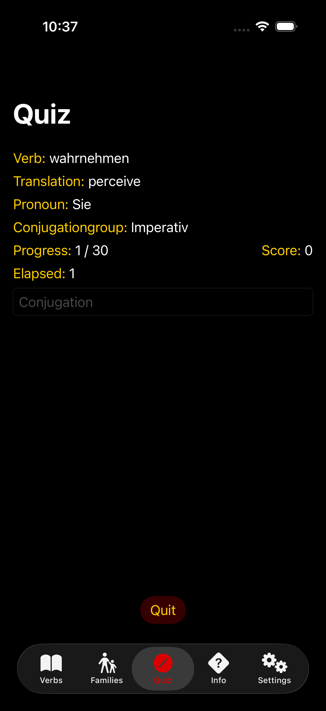 | 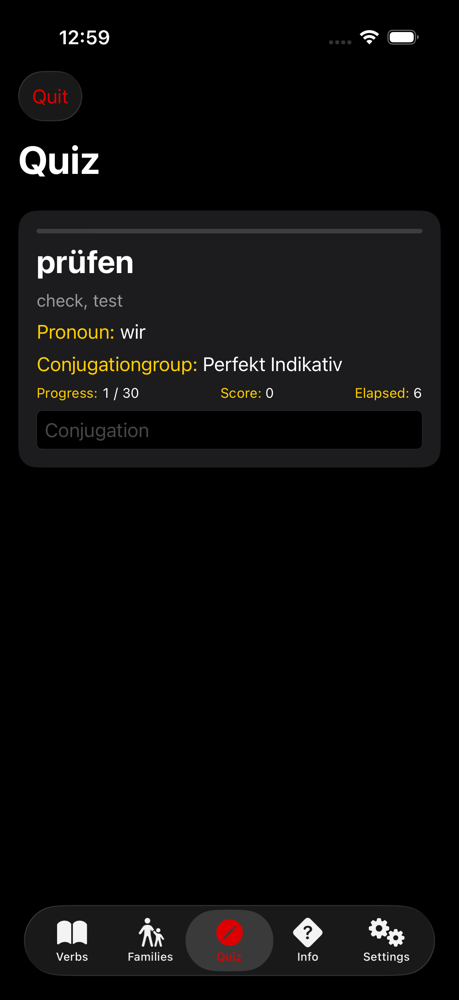 |

Before: Content pinned to top with empty black below. No structural framing. After: Wrapped in a card with progress bar, prominent verb display, and toolbar-integrated Quit button.

## Suggestion: Verb Detail Section Cards + Accent Bars

| Before | After |
|---|---|
|  | 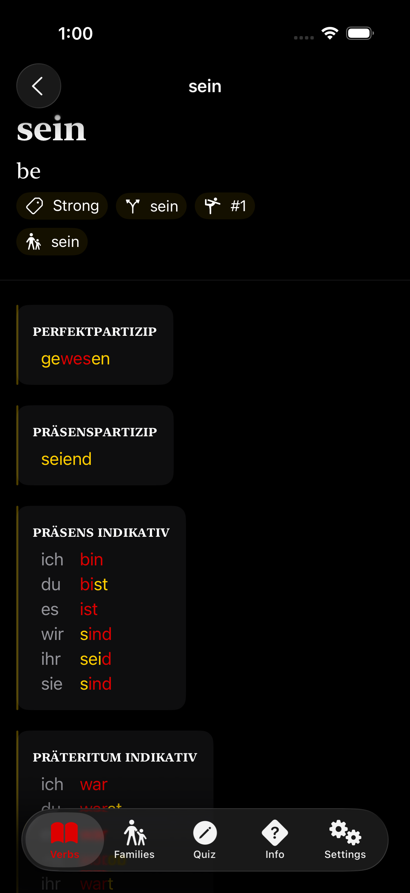 |

Before: Conjugation sections blend together on a flat background. After: Each section wrapped in a card with a yellow accent bar on the leading edge.

## Suggestion: Info Detail Serif Title + Reading Width

| Before | After |
|---|---|
| 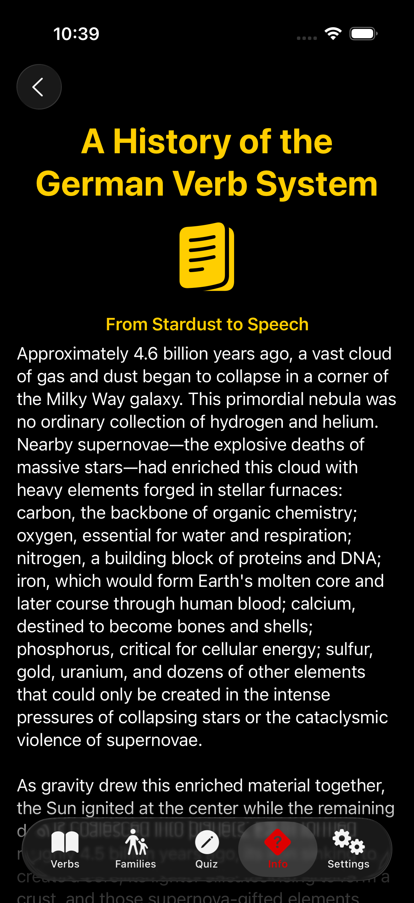 | 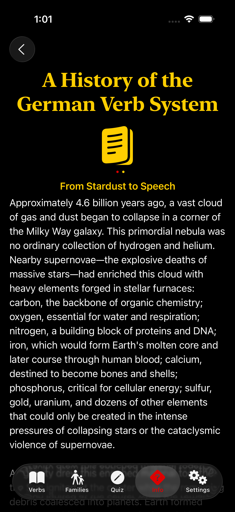 |

Before: Essay titles use the same font as navigation chrome. Full-width text on iPad. After: Serif title treatment, constrained reading width, improved line spacing.

## Suggestion: Settings Visual Section Grouping

| Before | After |
|---|---|
| 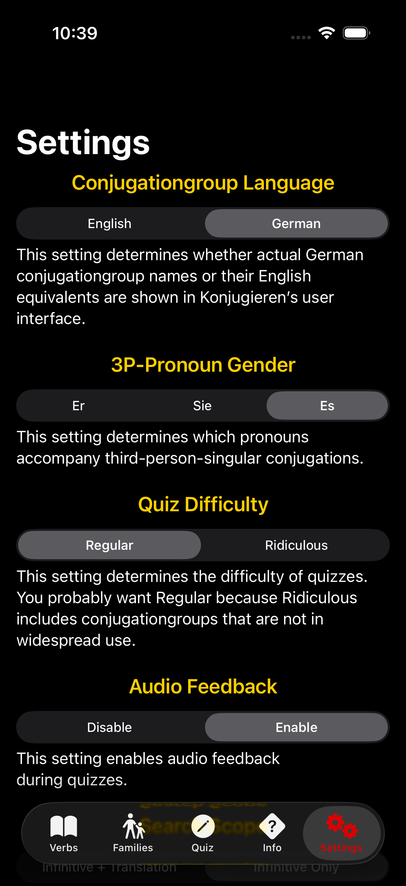 | 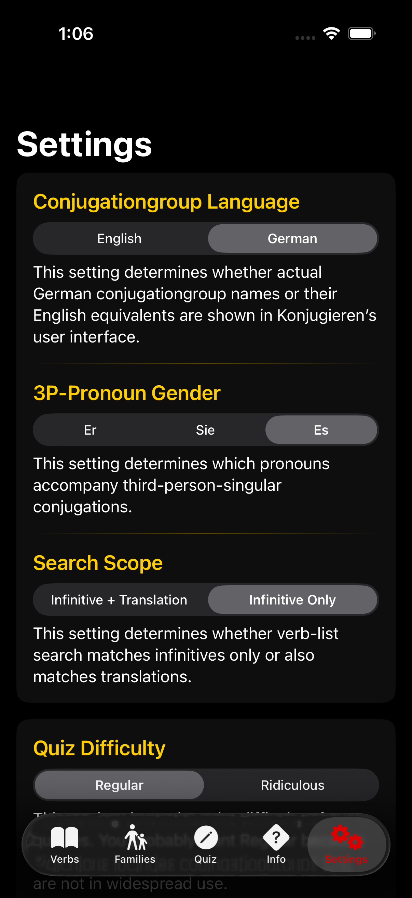 |

Before: All settings run together in one undifferentiated scroll. After: Grouped into logical cards with gradient separators.

## Suggestion: Results Large Score Display

| Before | After |
|---|---|
| 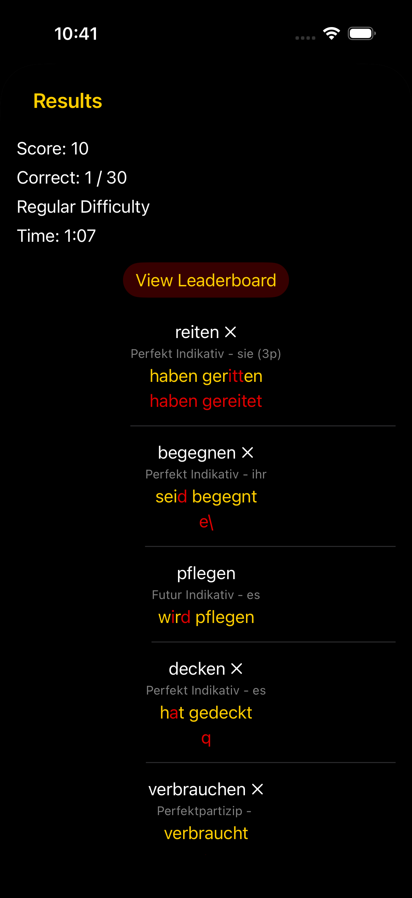 | 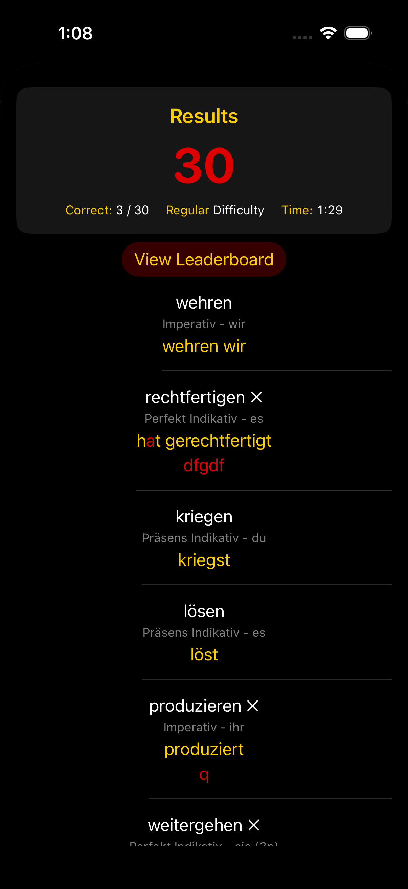 |

Before: Score is just another labeled text line. After: Large rounded-font score as focal point, color-coded by performance, with count-up animation.

## Suggestion: Verb List Empty-State View

| Before | After |
|---|---|
| 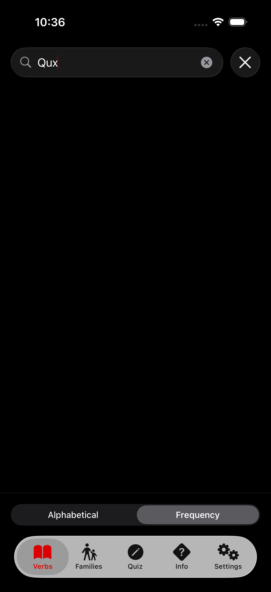 | 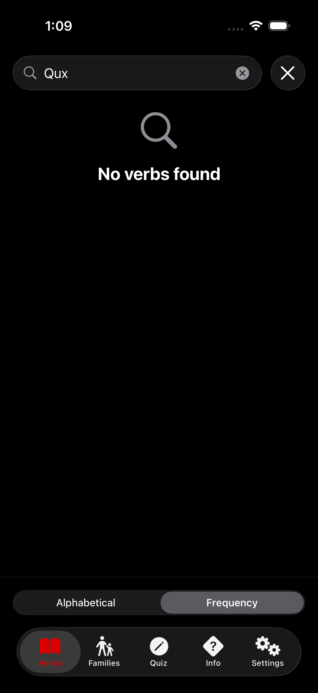 |

Before: Searching with no results shows a blank screen. After: `ContentUnavailableView` with search icon and message.

## Suggestion: Verb Detail Metadata Pills

| Before | After |
|---|---|
| 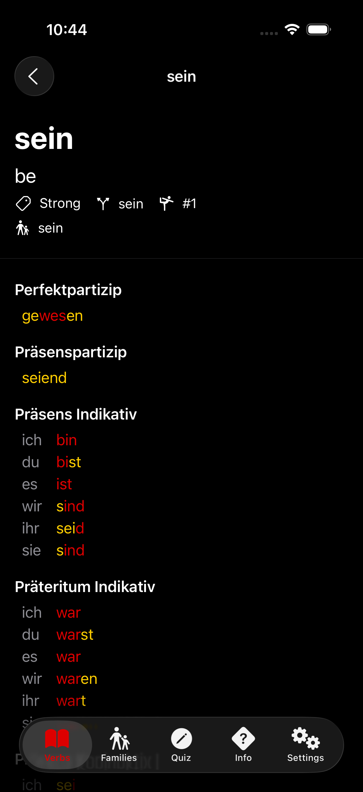 |  |

Before: Plain text metadata tags. After: Pill-shaped capsule backgrounds with subtle accent tint.

## Suggestion: Verb List Alternating Row Tint

| Before | After |
|---|---|
| 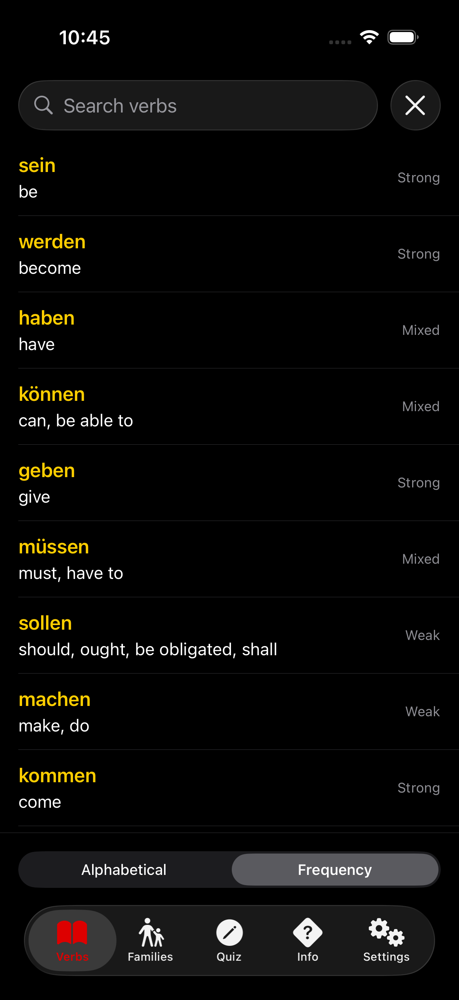 | 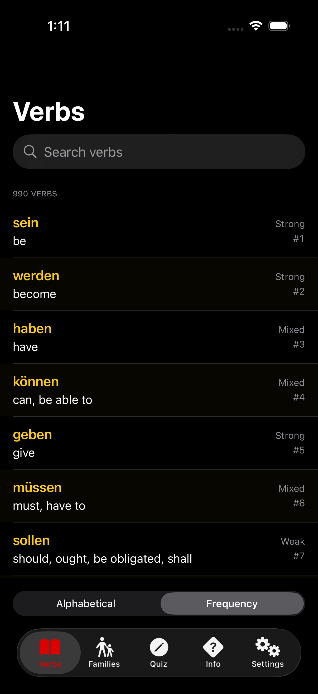 |

Before: Uniform row backgrounds. After: Alternating subtle yellow tint for visual rhythm and easier scanning.

## Beyond Aesthetics: Design Critique Surfaces Bug

One unexpected benefit: the audit identified that `TutorView` used `Color.customBackground` for assistant message bubbles, which was identical to the screen background, and that the bubbles were literally invisible. The text content *was* visible, but the benefit of the bubble shape, intended to provide spatial context about who was communicating what, had been lost. The code review that had already happened, which had been focused on correctness, missed this. A design review focused on "does this surface stand out from its background?" caught it immediately.

| Before | After |
|---|---|
| 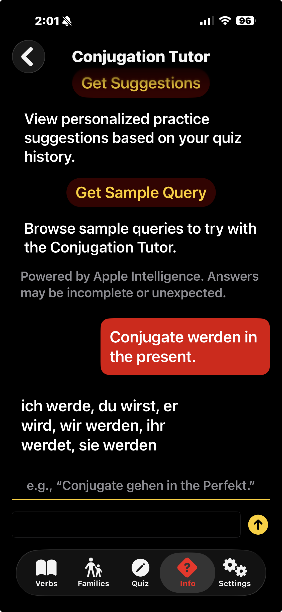 | 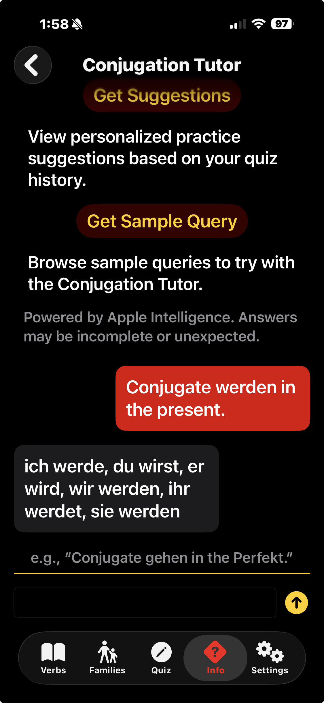 |

# How to Use This Skill

## Option A: Using skills.sh

Install this skill with a single command:

```bash
npx skills add https://github.com/vermont42/iOS-Design-Agent-Skill --skill ios-design-agent-skill
```

For more information, visit the [skills.sh platform](https://skills.sh).

Then use the skill in your AI agent, for example:

> Use the iOS design agent skill and audit my app's UI for typography, color, spatial composition, motion, and depth.

## Option B: Claude Code Plugin

### Personal Usage

To install this skill for your personal use in Claude Code:

1. Add the marketplace:
   ```
   /plugin marketplace add https://github.com/vermont42/iOS-Design-Agent-Skill
   ```
2. Install the skill:
   ```
   /plugin install ios-design-agent-skill
   ```

### Project-Wide Usage

To install this skill for everyone on a project, add the following to your `.claude/settings.json`:

```json
{
  "plugins": {
    "ios-design-agent-skill": {
      "source": "https://github.com/vermont42/iOS-Design-Agent-Skill"
    }
  }
}
```

## Option C: Cursor

Cursor marketplace approval is pending. Once approved, the skill will be installable directly from the Cursor marketplace.

## Option D: Gemini CLI

Gemini CLI natively supports the Agent Skills format. Install with:

```bash
gemini skills install https://github.com/vermont42/iOS-Design-Agent-Skill.git
```

The skill will be discovered automatically. Verify with `/skills list`.

## Option E: Antigravity

Antigravity supports the Agent Skills format. Install via:

```bash
npx skills add https://github.com/vermont42/iOS-Design-Agent-Skill --skill ios-design-agent-skill
```

Or clone the repo and place the `ios-design-agent-skill/` folder in `.agents/skills/` in your workspace.

## Option F: OpenAI Codex

Copy the `ios-design-agent-skill/` folder into your Codex skills directory. See `agents/openai.yaml` for the manifest.

## Option G: Manual Installation

1. Clone this repository
2. Copy or symlink the `ios-design-agent-skill/` folder into your tool's skills location:
   - Claude Code: `.claude/skills/`
   - Gemini CLI: `.gemini/skills/`
   - Antigravity: `.agents/skills/`
   - Or any directory your agent scans for skills

The skill works with any AI coding tool that supports the [Agent Skills open format](https://agentskills.io/specification).

# Acknowledgments

This skill is essentially a port to iOS of Anthropic's [Frontend Design Skill](https://github.com/anthropics/skills/blob/main/skills/frontend-design/SKILL.md).

This skill's readme's installation-and-use instructions borrow heavily from those of Antoine van der Lee's [SwiftUI Agent Skill](https://github.com/AvdLee/SwiftUI-Agent-Skill).

# License

This skill is provided under the open-source MIT License. See [LICENSE](LICENSE) for details.